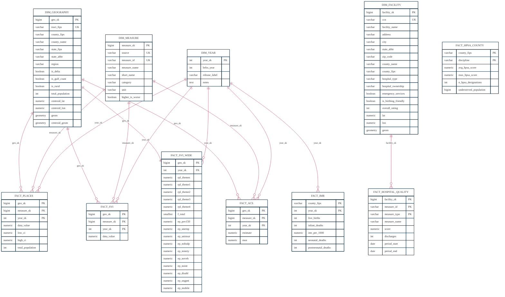

# Schema diagram

The entire database lives in a single Postgres schema called `public` and contains four dimension tables, seven fact tables, two TIGER staging tables that hold the raw PostGIS polygons, and five analytical marts. The diagram below shows the four dimensions and seven facts with every column they expose. Composite primary keys are indicated by multiple `PK` markers on the same table; foreign key relationships are drawn as connecting lines from the parent dimension.

The Mermaid block renders inline in GitHub, the VS Code Markdown preview, or any other viewer that supports Mermaid. You can also paste it into [mermaid.live](https://mermaid.live) to view it interactively. The theme initializer at the top of the block forces a white background and the project palette, matching the rest of the deck.

## Reading the diagram

The four dimension tables (`DIM_GEOGRAPHY`, `DIM_MEASURE`, `DIM_FACILITY`, `DIM_YEAR`) hold the descriptive context: who, what, where, and when. They tend to be small and stable. The seven fact tables hold the actual measurements and are much larger. Lines connecting dimensions to facts are foreign key relationships, where the notation `||--o{` means one row in the parent dimension is referenced by many rows in the fact table, and `||--||` means a one-to-one relationship (used between `dim_geography` and `fact_svi_wide`).

The `PK` notation marks a column that participates in the table's primary key. Tables with several `PK` markers have a composite primary key formed by the marked columns in combination. The `FK` notation marks a column that is a foreign key but not part of any primary key. The `UK` notation marks a column with a unique constraint.

Columns that are simultaneously part of a primary key and a foreign key (for example `fact_places.geo_sk`, which is part of the composite primary key and also references `dim_geography.geo_sk`) are marked `PK`. The foreign key relationship for those columns is shown by the connecting line from the parent dimension to the fact table.

`FACT_HPSA_COUNTY` is shown as a standalone fact because its keys (`county_fips`, `discipline`) are not declared as SQL foreign keys, although `county_fips` semantically aligns with `dim_geography.county_fips`. Joins from that fact to the rest of the model happen on the `county_fips` string.

## TIGER staging tables (not shown in the diagram)

Two staging tables sit in `public` to hold raw TIGER/Line polygons before PostGIS centroids and FIPS joins build out `dim_geography`. They are not part of the analytical star schema and exist purely as PostGIS loading targets.

| Table | Purpose |
|---|---|
| `stg_tiger_tract` | Raw 2023 census tract polygons for the United States, used to populate `dim_geography.geom` and compute `centroid_geom`. |
| `stg_tiger_county` | Raw 2023 county polygons for Mississippi, used by `mart_top20_priority` and the static county-level maps. |

Both tables carry the standard TIGER columns (`statefp`, `countyfp`, `tractce`, `geoid`, `name`, `namelsad`, `aland`, `awater`, `intptlat`, `intptlon`, `geom`).

## The mart layer

The five analytical marts are not shown in the diagram above because they are derived tables that read from the star schema rather than participating in the foreign key graph. The table below lists each mart along with its granularity and the source tables it reads from.

| Mart | Granularity | Reads from |
|---|---|---|
| `mart_maternal_risk_index` | one row per census tract | `dim_geography`, `fact_places`, `fact_svi_wide` |
| `mart_drive_time` | one row per census tract | `dim_geography`, `dim_facility` (joined through PostGIS) |
| `mart_double_burden` | one row per census tract | `mart_maternal_risk_index`, `mart_drive_time`, `fact_svi_wide` |
| `mart_top20_priority` | one row per Mississippi county | `mart_maternal_risk_index`, `mart_drive_time`, `fact_imr`, `svi_county` |
| `mart_hrrp_regressivity` | one row per quintile per HRRP measure | `dim_facility`, `fact_hospital_quality`, `svi_county` |
